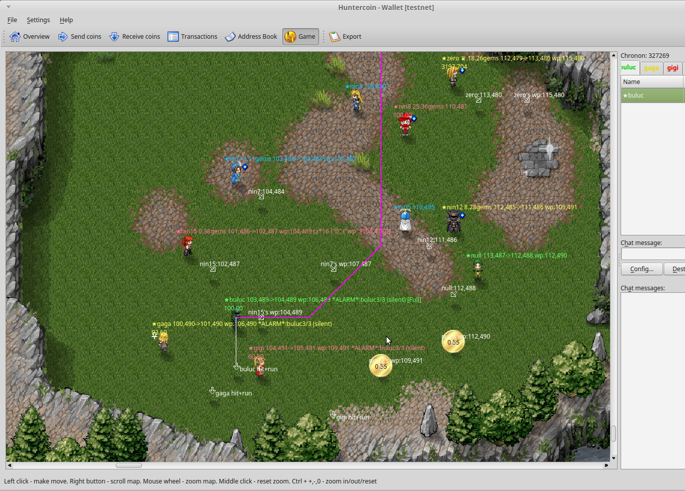

Huntercoin
==========

Human-mineable crypto currency / decentralized game

www.huntercoin.org

latest Windows build:

huntercoin-qt-v140-win32-20170223.zip, 19.9 MB

https://mega.nz/#!rB01UAhB!ngojKw0fGXLzWnUCsqwsMCFFsF2rnuZydKFlzDOFIVg

To build on a new Ubuntu 16.04 or Linux Mint 18

    sudo apt-get install libboost-chrono-dev libboost-date-time-dev libboost-filesystem-dev libboost-program-options-dev libboost-serialization-dev libboost-system-dev libboost-thread-dev
    sudo apt-get install libboost-dev git qt4-qmake libqt4-dev build-essential qt4-linguist-tools libssl-dev
    sudo apt-get install libdb++-dev

if Qt Creator is installed after this, open huntercoin-qt.pro, and Build | Build project huntercoin-qt, otherwise

    qmake
    make

Advanced mode
=============

rename huntercoin-qt to huntercoin-qt-safemode and uncomment this to build in advanced mode:

https://github.com/wiggi/huntercoin/blob/betterQt-with-storage/src/gamestate.h#L17

Don't forget to copy the gamestate file game_sv4.dat to '.huntercoin', and make sure that the
blockchain is always equally or more up-to-date than the gamestate.

Fast blockchain download
========================

http://forum.huntercoin.org/index.php/topic,24070.0.html

